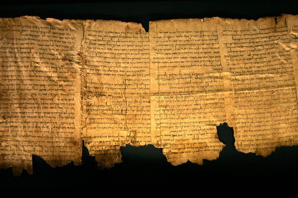

  

Next time somebody (like say, <a href="http://blog.spreadingsantorum.com/" target="_blank">a Republican presidential candidate</a>) refers to Chapter 18 of the book of Leviticus saying that "the bible says homosexuality is an abomination," I'm going to show them this passage, from a few chapters earlier in the same book:

<!--more-->

<blockquote><strong><em>Leviticus, Chapter 12</em></strong>

<strong>The purification of women after childbirth.</strong>

<em>1</em> And the Lord spoke to Moses, saying: <em>2</em> Speak to the children of Israel, and thou shalt say to them: If a woman having received seed shall bear a man child, she shall be unclean seven days, according to the days of the separation of her flowers. <em>3</em> And on the eighth day the infant shall be circumcised: <em>4</em> But she shall remain three and thirty days in the blood of her purification. She shall touch no holy thing, neither shall she enter into the sanctuary, until the days of her purification be fulfilled. <em>5</em> But if she shall bear a maid child, she shall be unclean two weeks, according to the custom of her monthly courses, and she shall remain in the blood of her purification sixty-six days.

<em>6</em> And when the days of her purification are expired, for a son, or for a daughter, she shall bring to the door of the tabernacle of the testimony, a lamb of a year old for a holocaust, and a young pigeon or a turtle for sin, and shall deliver them to the priest: <em>7</em>Who shall offer them before the Lord, and shall pray for her, and so she shall be cleansed from the issue of her blood. This is the law for her that beareth a man child or a maid child. <em>8</em> And if her hand find not sufficiency, and she is not able to offer a lamb, she shall take two turtles, or two young pigeons, one for a holocaust, and another for sin: and the priest shall pray for her, and so she shall be cleansed.</blockquote>
Relevant, practical stuff! Let's all abide by it extremely literally, every day. Or perhaps this passage, from one chapter later:
<blockquote><strong><em>Leviticus, Chapter 19</em></strong>

<strong>Divers ordinances, partly moral, partly ceremonial or judicial.</strong>

<em>26</em> You shall not eat with blood. You shall not divine nor observe dreams. <em>27</em> Nor shall you cut your hair roundwise: nor shave your beard. <em>28</em> You shall not make any cuttings in your flesh, for the dead, neither shall you make in yourselves any figures or marks: I am the Lord. <em>29</em> Make not thy daughter a common strumpet, lest the land be defiled, and filled with wickedness. <em>30</em> Keep ye my sabbaths, and reverence my sanctuary. I am the Lord.</blockquote>
So, if you've ever shaved your beard, or "cut your hair roundwise," you're not allowed to quote Leviticus as though it still holds up. Not to mention the fact that the entirety of Christianity is based on the idea that Jesus' sacrifice fulfills all the Old Testament preconditions and establishes a new covenant.
<blockquote><strong><em>Hebrews, Chapter 8</em></strong>

<strong>More of the excellence of the priesthood of Christ and of the New Testament.</strong>

1 Now of the things we have spoken, this is the sum: We have such an high priest, who is set on the right hand of the throne of majesty in the havens, 2 A minister of the holies, and of the true tabernacle, which the Lord hath pitched, and not man. 3 For every high priest is appointed to offer gifts and sacrifices: wherefore it is necessary that he also should have some thing to offer. 4 If then he were on earth, he would not be a priest: seeing that there would be others to offer gifts according to the law, 5 Who serve unto the example and shadow of heavenly things. As it was answered to Moses, when he was to finish the tabernacle: See (saith he) that thou make all things according to the pattern which was shewn thee on the mount. 6 But now he hath obtained a better ministry, by how much also he is a mediator of a better testament, which is established on better promises.

7 For if that former had been faultless, there should not indeed a place have been sought for a second. 8 For finding fault with them, he saith: Behold, the days shall come, saith the Lord: and I will perfect unto the house of Israel, and unto the house of Juda, a new testament: 9 Not according to the testament which I made to their fathers, on the day when I took them by the hand to lead them out of the land of Egypt: because they continued not in my testament: and I regarded them not, saith the Lord. 10 For this is the testament which I will make to the house of Israel after those days, saith the Lord: I will give my laws into their mind, and in their heart will I write them: and I will be their God, and they shall be my people:

11 And they shall not teach every man his neighbour and every man his brother, saying, Know the Lord: for all shall know me from the least to the greatest of them: 12Because I will be merciful to their iniquities, and their sins I will remember no more.13 Now in saying a new, he hath made the former old. And that which decayeth and groweth old, is near its end.

11 And they shall not teach every man his neighbour and every man his brother, saying, Know the Lord: for all shall know me from the least to the greatest of them: 12Because I will be merciful to their iniquities, and their sins I will remember no more.13 Now in saying a new, he hath made the former old. And that which decayeth and groweth old, is near its end.</blockquote>
So, the new testament says that Jesus' new covenant is "a better ministry," and "a mediator of a better testament, which is established on better promises," than the one passed down to Moses in the Old Testament.

It also says the very fact that Jesus came to establish a new covenent implies that "if the former had been faultless, there should not indeed a place have been sought for a second," or, basically, that Jesus wouldn't have come at all if there weren't problems with the laws established in the Old Testament that he was sent to rectify.

So, not only is being homophobic make you a bigoted, judgmental jerk, it also means you are <em>directly defying your own (supposed) Christianity by citing a passage from the bible that Jesus himself makes obsolete</em>.

Great job! St. Peter probably can't wait to pat you on the back up at the old pearly gates.

<em>All passages from the Douay-Rheims Catholic Bible.</em>
