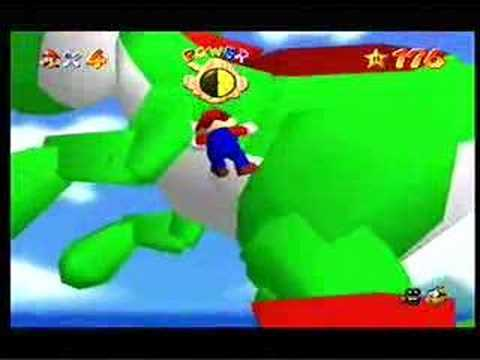

--
template: post
title: Why I Program - Game Genie  
--

You can ask anyone who knew me when I was little, I was very obsessed with the NES. My childhood reaction to receiving one for Christmas is the sort of thing that your family likes to bring up to embarrass you in front of girls.

But, my fascination was always deeper than just playing the games. The very *idea* that somewhere inside that cartridge was magic code that made Mario jump and Bowser throw fireballs was a big part of what drew me into playing the games as often as I did.

Nothing solidified that concept in my young brain as much as the **Game Genie**, the dongle that allowed you to enter your own secret codes that would alter the fabric of the game as you played it.

The only game I recall actually using it to cheat on was *The Legend of Zelda: Link's Awakening* for the SNES. Infinite hearts allowed my ten-year-old self to get past the difficult boss fights and go dungeon-crawling to solve the puzzles I loved without having to worry about a game over.

Mostly I loved the Game Genie for it's other purpose: altering the game in ways the developers never intended, to often hilarious results. Moon Jump. Color palate switches. Debug levels. You were essentially altering the game memory at load-time and could cause all kinds of crazy side-effects.

ZSNES, a Super Nintendo emulator for the PC, even let you pause your game, take note of various memory values that had changed since your last pause, and generate you own Game Genie codes.

This was effectively a sidelong introduction to the concepts of programming for me at a young age. Altering the state of memory of the machine could affect the program as it ran. That means that there is a program. There is memory. <a href="http://en.wikipedia.org/wiki/Finite-state_machine" title="Wikipedia">There is such a thing as "state" in the machine</a>. Fascinating.

Of course, today I use much higher-level programming languages, and prefer to do most of my development on the web, since it's 2013 and <a href="http://www.hanselman.com/blog/AppsAreTooMuchLike1990sCDROMsAndNotEnoughLikeTheWeb.aspx" title="Scott Hanselman">apps are like CD-ROMs from the 1990s</a>. So I'm not dealing with low-level memory addressing on a day-to-day basis.

But I still find it fascinating.

Now go read about <a href="http://www.mentalfloss.com/article/12793/how-did-game-genie-work" title="Mental Floss">how the Game Genie worked</a>.
